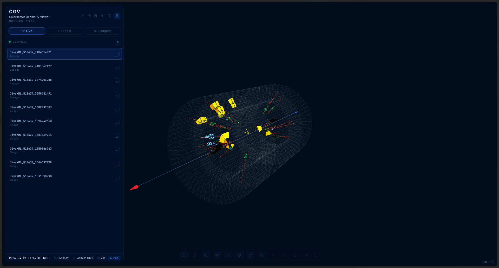
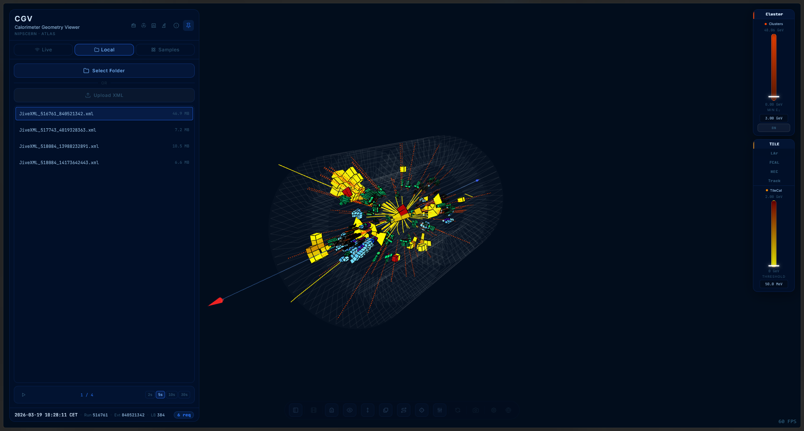
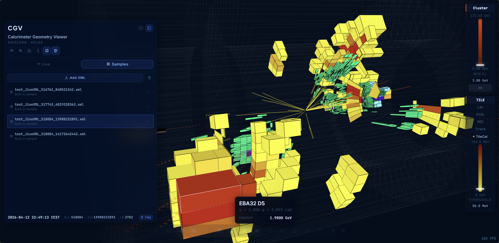

# Data Modes

CGV Web can source events from three places. The mode bar at the top of the
sidebar chooses one — only one is active at a time.

---

## Live

Polls the **ATLAS Live** bridge for the latest JiveXML events published by
the ATLANTIS project.

| Control | Action |
|---------|--------|
| Green pulse dot   | Polling is active. |
| **▶ play**        | Resume polling after a pause. |
| **■ stop**        | Pause polling (the current event stays visible). |
| Event list        | Click any row to replace the scene with that event. |

Until the first batch arrives you see an *empty state* illustration. The
connection itself is handled outside this repo — see the
`live_atlas/` directory or [atlas-live.cern.ch](https://atlas-live.cern.ch).

---

## Local

Loads JiveXML files from your machine. Two pickers:

| Picker                | Accepts                               |
|-----------------------|----------------------------------------|
| **Select Folder**     | A directory; every `.xml` inside is listed. |
| **Upload XML**        | A single `.xml` file. |

When more than one file is loaded, the **Carousel** appears:

- **▶ / ■** — start / stop auto-advance.
- **2 s · 5 s · 10 s · 30 s** — delay between events.

Useful for demos, noise studies, or any sweep through a run.

---

## Samples

Lists events bundled with the project (`default_xml/index.json`). Click a
row to load it. No network required — good for offline demos.

To add your own samples, drop the `.xml` into `default_xml/` and add an
entry in `default_xml/index.json`.

---

## What the viewer does on load

1. Reads the `<Event>` header (run + event number).
2. Extracts cell blocks (`<TILE>`, `<LAr>`, `<HEC>`, `<FCAL>`).
3. Decodes every cell ID through the [ATLAS-ID parser](EventData.md#cell-ids).
4. Colours and reveals each cell at its position in the `.glb`.
5. Draws `<Track>` polylines (yellow) and `<Cluster>` η/φ lines (red dashed).
6. Initialises the [threshold sliders](EnergyThresholds.md) from the event's
   energy range.

Switching mode or loading a different event calls `resetScene()` — all
previously active cells, tracks, and clusters are cleared; ghost envelopes
and layer visibility are preserved.

---

*See also:* [Event Data](EventData.md) · [Getting Started](GettingStarted.md)
