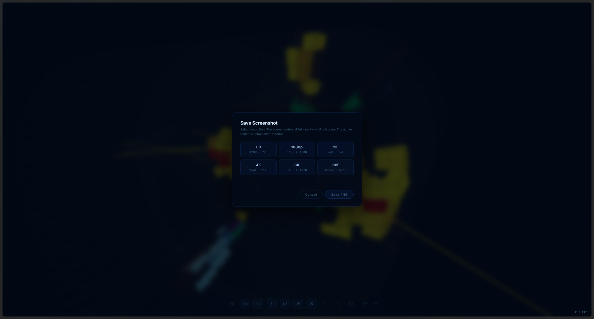

# Getting Started

## 1. Open the viewer

The viewer is a static web app. From the project root:

```bash
python -m http.server 8080
# or
npx serve .
```

Then open `http://localhost:8080` in a modern browser (Chrome, Firefox, Edge,
Safari 15+). The loading screen disappears once the geometry (`.glb`) and
the ATLAS-ID parser (WebAssembly) are both ready.


## 2. Pick a data mode

The top-left **mode bar** has three options. See [Data Modes](DataModes.md).

| Mode     | Use when…                                                     |
|----------|---------------------------------------------------------------|
| **Live**    | You want the latest events streamed from [ATLAS Live](https://atlas-live.cern.ch). |
| **Local**   | You have one or more JiveXML files on disk.                |
| **Samples** | You want to browse events bundled with the project.        |

## 3. Load an event

Click any event in the sidebar. The viewer:

1. Parses the JiveXML.
2. Decodes every cell ID through the WebAssembly parser (ATLAS ID dictionary).
3. Colours each cell by its energy and reveals it in the scene.
4. Draws any `<Track>` and `<Cluster>` objects present.

See [Event Data](EventData.md) for the XML format.

## 4. Explore

- **Rotate:** left-drag
- **Zoom:** wheel
- **Pan:** right-drag or Ctrl+left-drag
- **Hover a cell:** tooltip shows the cell name (e.g. `A1`, `BC8`, `D6`)
  and the energy in GeV.
- **Threshold:** open the right-side [Energy Thresholds](EnergyThresholds.md)
  panel to hide low-energy cells.
- **Geometry toggles:** see [Geometry](Geometry.md) for layers, ghost
  envelopes, and the beam axis.

## 5. Save your view

Press **P** or click the camera button to open the screenshot dialog.
Resolutions range from 720 p to 10 K. The UI is hidden during capture; the
active tooltip is composited if visible.



## Next

→ [User Interface](UserInterface.md) — every button explained
→ [Keyboard Shortcuts](KeyboardShortcuts.md)

*See also:* [Troubleshooting](Troubleshooting.md)
