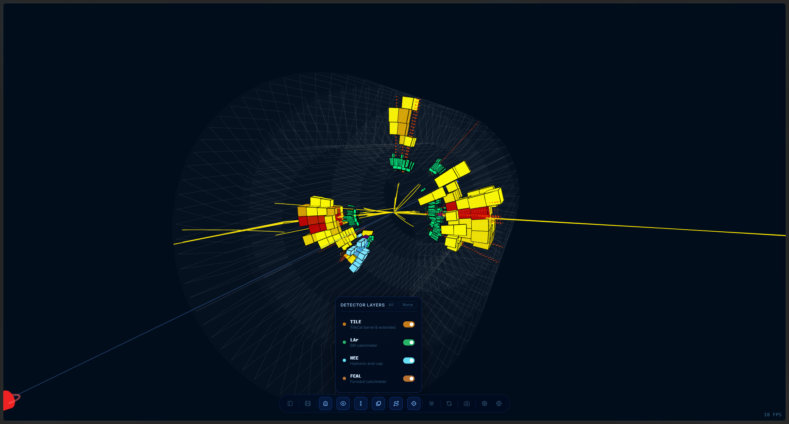
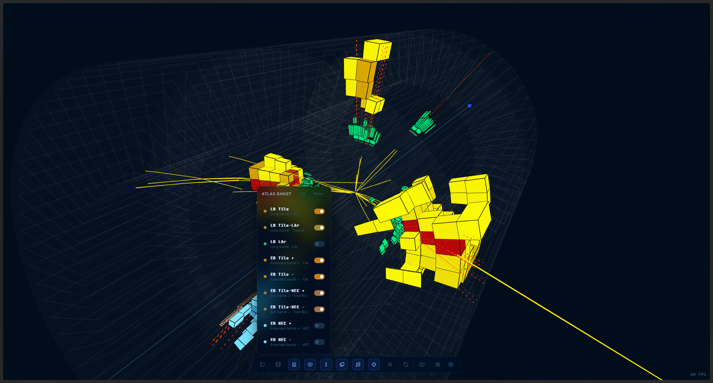
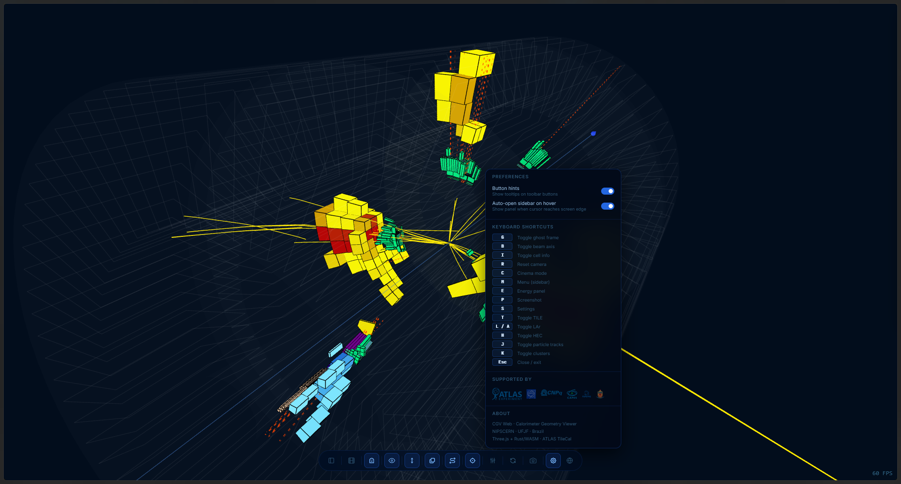

# User Interface

The interface has three zones:

1. **Left sidebar** — event source + status bar.
2. **Right side-panel** — per-detector energy threshold sliders.
3. **Bottom toolbar** — scene tools.

---

## Left sidebar

### Header

| Control | Action |
|---------|--------|
| **CGV logo**                      | Decorative; identifies the app + lab. |
| External link icons (radio, atom, building, microscope) | Quick links to [ATLAS Live](https://atlas-live.cern.ch), [atlas.cern](https://atlas.cern), [home.cern](https://home.cern), [nipscern.com](https://nipscern.com). |
| **ⓘ About**                        | Opens a credits overlay. |
| **Pin**                            | Keep the sidebar open even when the pointer leaves it. When unpinned, it auto-hides on mouse-out. |

### Mode bar

Three buttons select where events come from. See [Data Modes](DataModes.md).

- **Live** — poll ATLAS Live for incoming events.
- **Local** — upload one XML file or a folder.
- **Samples** — pick from bundled demo events.

### Status bar (bottom of sidebar)

Shows the current state (Initializing / Ready / Downloading / Error) plus a
request counter badge (total network requests this session).

---

## Bottom toolbar

| Icon | ID | Shortcut | Action |
|------|----|----------|--------|
| Sidebar              | `btn-panel`    | **M** | Show / hide the left sidebar. |
| Film                 | `btn-cinema`   | **C** | **Cinema mode** — hide UI, auto-rotate the camera. Click anywhere or press **Esc** to exit. |
| Ghost                | `btn-ghost`    | **G** | Open the **Ghost envelope** popover. Nine per-mesh switches + All/None. See [Geometry](Geometry.md). |
| Eye / Eye-off        | `btn-info`     | **I** | Cell tooltip on hover. When off, cells are still interactive but silent. |
| Beam axis            | `btn-beam`     | **B** | Show the Z-axis line with N/S cones at ±z. |
| Layers               | `btn-layers`   | —     | Open the **Detector layers** popover (TILE / LAr / HEC). Hides entire detector categories. |
| Route                | `btn-tracks`   | **J** | Show / hide reconstructed **particle tracks** (yellow polylines). |
| Focus                | `btn-cluster`  | **K** | Show / hide **clusters** (red dashed η/φ lines). |
| Sliders              | `btn-rpanel`   | **E** | Toggle the right-side **[Energy threshold](EnergyThresholds.md)** panel. |
| Refresh              | `btn-reset`    | **R** | Reset the camera to the default position. |
| Camera               | `btn-shot`     | **P** | Open the **screenshot** dialog (HD → 10 K). |
| Settings             | `btn-settings` | **S** | Preferences · shortcuts · sponsors. |
| Globe                | `btn-lang`     | —     | Language picker (en / fr / no / pt). |
| **×**                | `btn-toolbar-close` | — | Mobile only — collapse the toolbar. |

### Layers popover

Per-category toggles with **All** / **None** shortcuts. Hiding a category
fully hides every cell in it, independent of the energy threshold.

### Ghost popover

Nine per-envelope switches — each sub-volume of the calorimeter hull has
its own on/off. All ghosts share the same material (grey, ~1 % opacity) so
they look uniform regardless of what the GLB assigned them. Useful as a
visual frame while high-energy cells remain focal.

### Settings popover

- **Button hints** — toolbar tooltips on/off.
- **Auto-open sidebar on hover** — reveals the sidebar when the pointer
  reaches the screen edge.
- Full keyboard-shortcut reference.
- Sponsors and credits.

---

## Right side-panel

One tab per object type. Open with **E** or the sliders button.

Tabs (click to switch): **TILE · LAr · FCAL · HEC · Track · Cluster**.
Each tab has a vertical slider (min → max) and a numeric input (accepts
`MeV` or `GeV` suffixes; bare numbers are MeV). Full details on
[Energy Thresholds](EnergyThresholds.md).

---

*See also:* [Keyboard Shortcuts](KeyboardShortcuts.md) ·
[Data Modes](DataModes.md) · [Geometry](Geometry.md)
